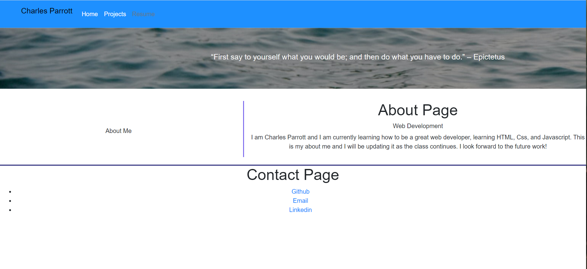

# React Portfolio

## Description

Being a web developer requires a working portfolio to display some basic information about you as a developer, links to some of your biggest projects to show off your skill, a way to contact you, and a resume.

## Tools

Using React, Javascript, HTML, and CSS to display a working personal portfolio to give a good example of you as a developer

## Example

The following image is an example of the main page display

## Deployed application

React portfolio can be opened at [React Portfolio](https://crparrott.github.io/react-portfolio/)